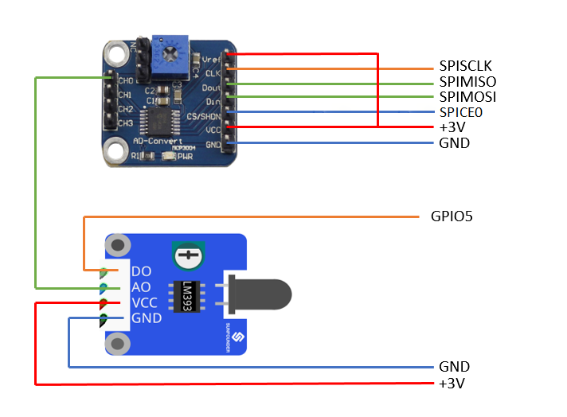

# SmartHomePrototype
SmartHome system implemented using Raspberry Pi & Sunfounder kit.

		

System is consisted of two components:
1)Client component was written in Python using GPIO libraries. This component has two functionalities:
	- collecting measurements from sensor and send those data to server.
	- waiting for instructions from server to start some actuators.
	The prototype was realized using following sensors/actuators from Sunfounder kit:
		Dual-Color LED
		Buzzer Module
		Sound sensor
		Flame sensor
		Touch switch
		DS18B20 Temperature sensor
		Rain detection module
		MCP3004 (This module is not described in Sunfounder manual. To connect this module, check following scheme)
	To start client app, run main.py script.
	

		
	

2)Server component was realized using Node.js. To start server, following modules need to be installed:
	-mongodb (npm install mongodb)
	-mongodb (npm install net)
	-mongodb (npm install express)

  
  

